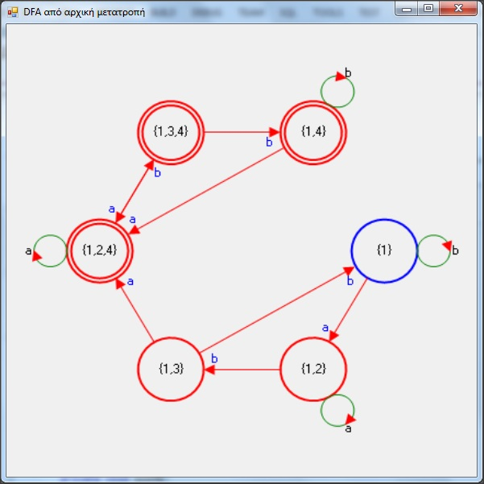
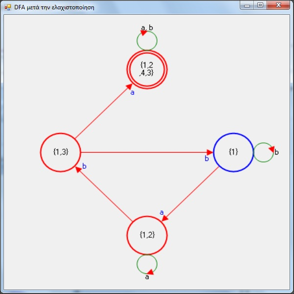
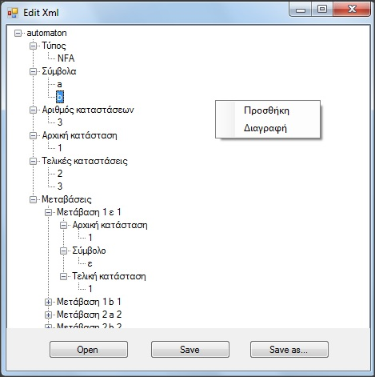
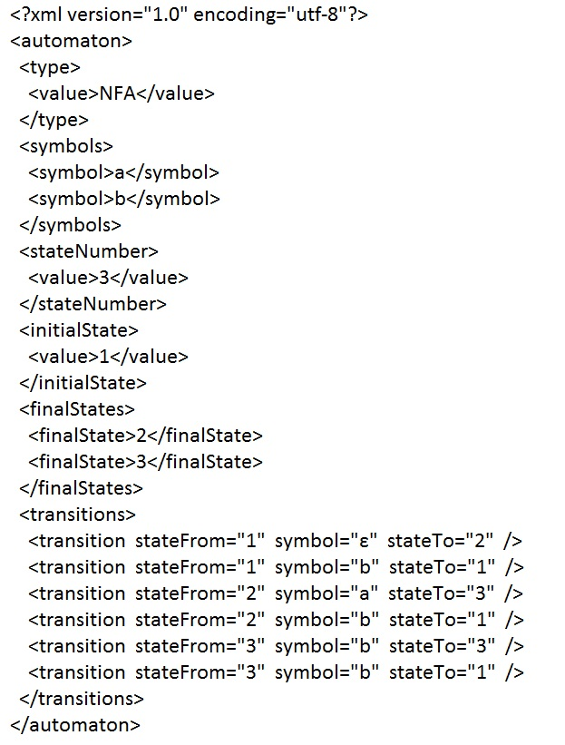
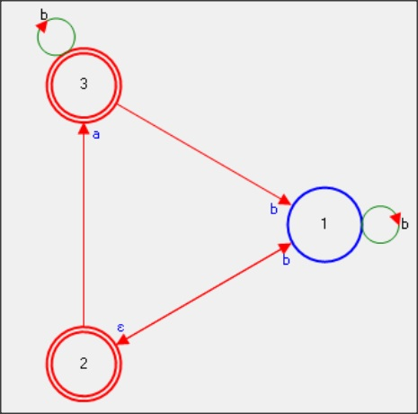

There are two folders:
------------------------------------------------------------
# 2014: first version. 
This code was written for the lesson "Computation theory".

Features: 

  1. Automata descriptions are in simple text files.
  
  2. Check if a word belongs to the language of the automaton
  
  3. Convert a NFA to DFA
  
  4. Minimize converted DFA

   
# 2015: second version. 

Refactoring the design of existing code.

This code was written for the lesson "Software Engineering". In this version there is a more object oriented approach.

Features: 

  1. Automata descriptions are in xml files.
  
  2. There is an editor for those xml files.
  
  3. Check if a word belongs to the language of the automaton
  
    
  
  